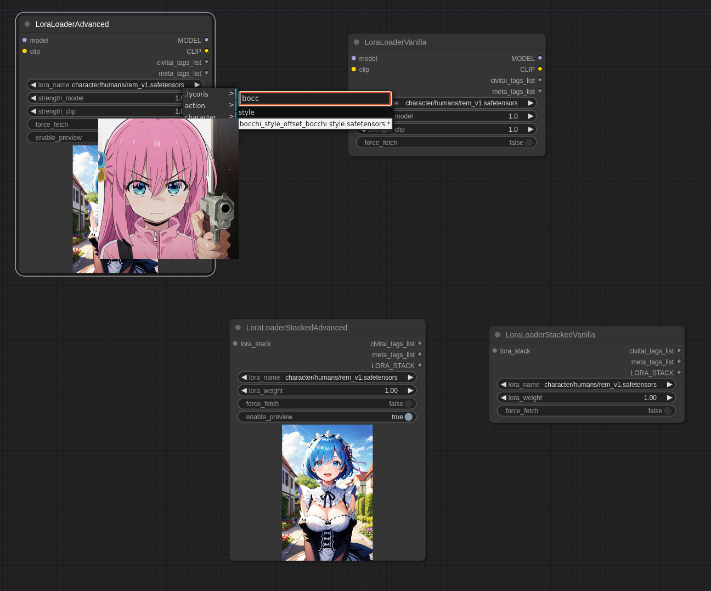
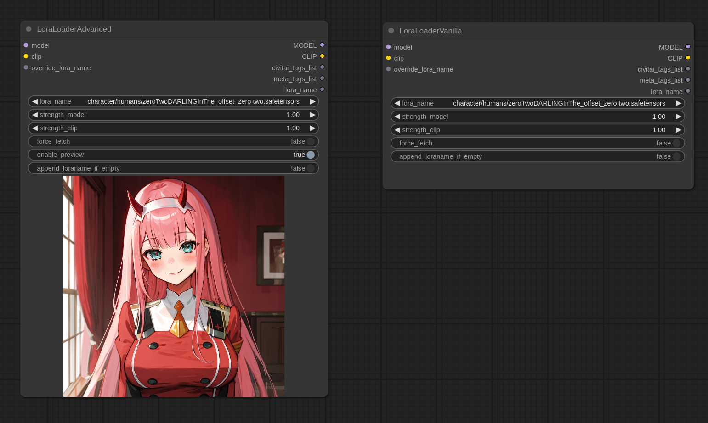
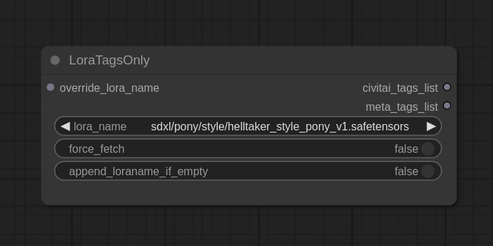
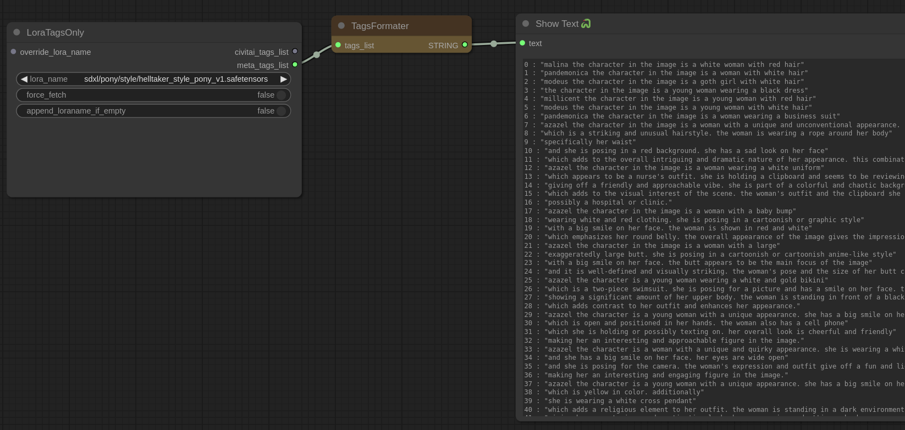
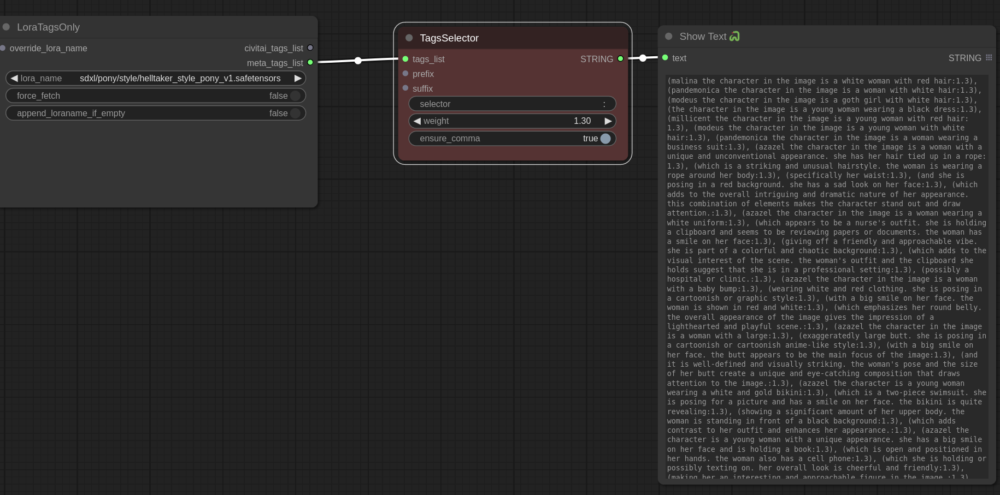
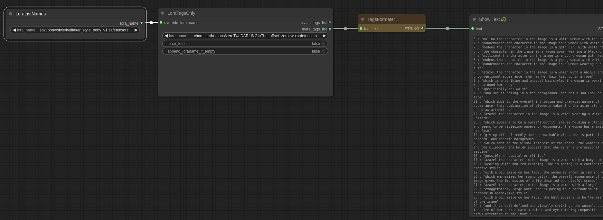
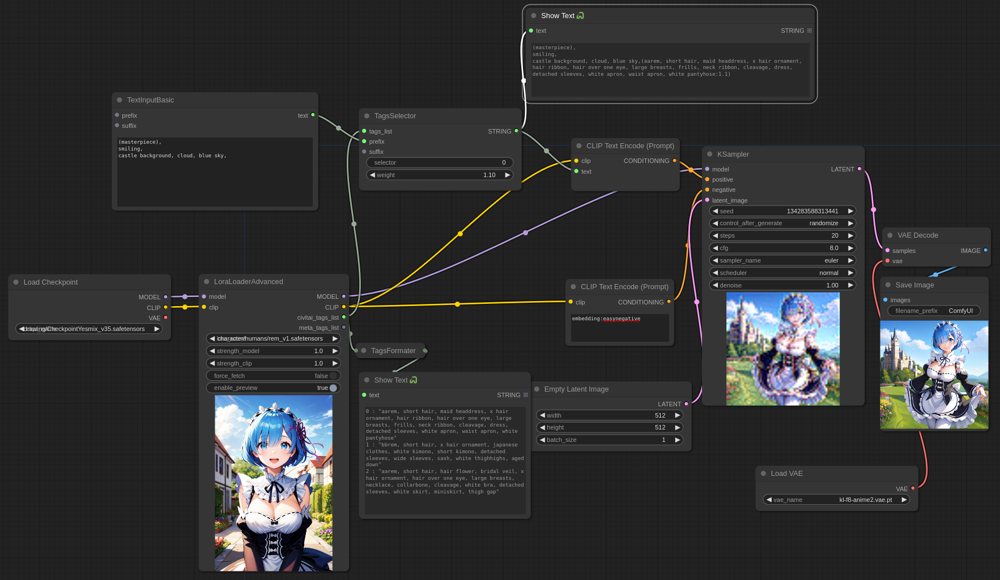
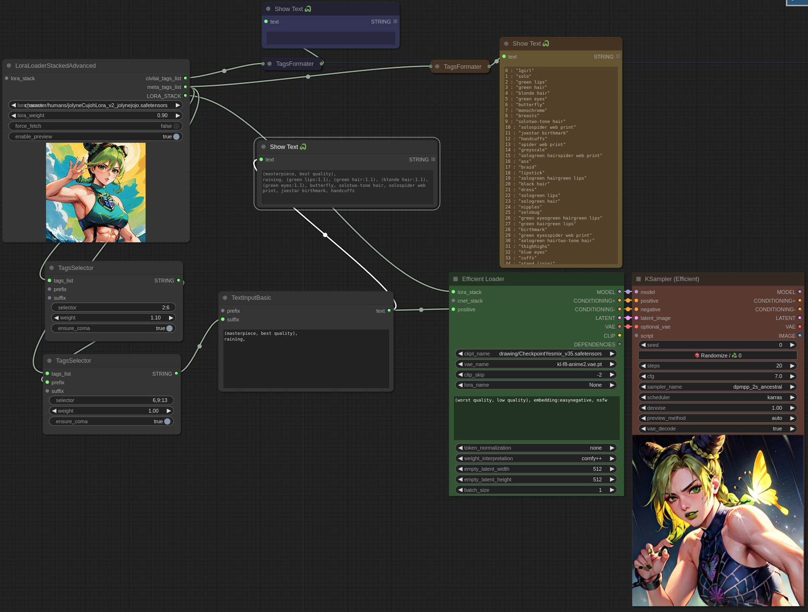

# ComfyUI-Lora-Auto-Trigger-Words

This project is a fork of https://github.com/Extraltodeus/LoadLoraWithTags
The aim of these custom nodes is to get an _easy_ access to the tags used to trigger a lora. 
This project is compatible with Stacked Loras from https://github.com/jags111/efficiency-nodes-comfyui  
When I talk about **lora**, I also mean **lycoris** too.

## Install
Some of this project nodes depends on https://github.com/pythongosssss/ComfyUI-Custom-Scripts :
- LoraLoaderAdvanced
- LoraLoaderStackedAdvanced
- `View info...`
They get their vanilla equivalents. 

Overall, Custom-Scripts is recommended to be able to know the content of the tag lists with the node `showText`

## Features
#### Vanilla vs Advanced
Vanilla refers to nodes that have no lora preview from the menu, nor the lora list. But the features provided are the same.

### Nodes
#### LoraLoader (Vanilla and Advanced)

INPUT
- `override_lora_name` (optional): Used to ignore the field `lora_name` and use the name passed. Should use [LoraListNames](#loralistnames) or the `lora_name` output.

FIELDS
- `force_fetch`: Force the civitai fetching of data even if there is already something saved
- `enable_preview`: Toggle on/off the saved lora preview if any (only in advanced)
- `append_lora_if_empty`: Add the name of the lora to the list of tags if the list is empty 

OUTPUT
- `civitai_tags_list`: a python list of the tags related to this lora on civitai
- `meta_tags_list`: a python list of the tags used for training the lora embeded in it (if any)
- `lora_name`: the name of the current selected lora
#### LoraLoaderStacked (Vanilla and Avanced). 

INPUT
- `lora_stack` (optional): another stack of lora.
- `override_lora_name` (optional): Used to ignore the field `lora_name` and use the name passed. Should use [LoraListNames](#loralistnames) or the `lora_name` output.

FIELDS
- `force_fetch`: Force the civitai fetching of data even if there is already something saved
- `enable_preview`: Toggle on/off the saved lora preview if any (only in advanced)
- `append_lora_if_empty`: Add the name of the lora to the list of tags if the list is empty 

OUTPUT
- `civitai_tags_list`: a python list of the tags related to this lora on civitai
- `meta_tags_list`: a python list of the tags used for training the lora embeded in it (if any)
- `lora_name`: the name of the current selected lora
#### LoraTagsOnly 

To get the tags without using the lora.
- `override_lora_name` (optional): Used to ignore the field `lora_name` and use the name passed. Should use [LoraListNames](#loralistnames) or the `lora_name` output.

OUTPUT
- `civitai_tags_list`: a python list of the tags related to this lora on civitai
- `meta_tags_list`: a python list of the tags used for training the lora embeded in it (if any)
- `lora_name`: the name of the current selected lora

#### TagsFormater

Helper to show the available tag and their indexes. Tags are sorted by training frequence. The more a tag was used, the higher in the list it is. Works for both `civitai_tags_list` and `meta_tags_list`

#### TagsSelector

Allow to filter tags and apply a weight to it.  
TagSelector contains four parameters. 
- `selector` (see the [Filtering](#filtering) section next)
- `weight`: to format the tag like `(tag:weight)`. Default set to 1 without the weight like `tag`.
- `ensure_comma`. To properly append comma if a prefix or suffix is added.

#### LoraListNames

List all the existing lora names. It is used as an input for `override_lora_name`

### Filtering
The format is simple. It's the same as python list index, but can select multiple index or ranges of indexes separated by comas.
`Ex: 0, 3, 5:8, -8:`
- Select a specific list of indexes: `0, 2, 3, 15`...
- Select range of indexes: `2:5, 10:15`...
- Select a range from the begining to a specific index: `:5`
- Select a range from a specific index to the end: `5:`
- You can use negative indexes. Like `-1` to select the last tag
- By default `:` selects everything

### Examples
#### Example of normal workflow

#### Example of Stacked workflow

#### Chaining Selectors and Stacked
Tags selectors can be chained to select differents tags with differents weights `(tags1:0.8), tag2, (tag3:1.1)`.
Lora Stack can also be chained together to load multiple loras into an efficient loaders.

### Side nodes I made and kept here
- FusionText: takes two text input and join them together
- Randomizer: takes two couples text+lorastack and return randomly one of them
- TextInputBasic: just a text input with two additional input for text chaining
